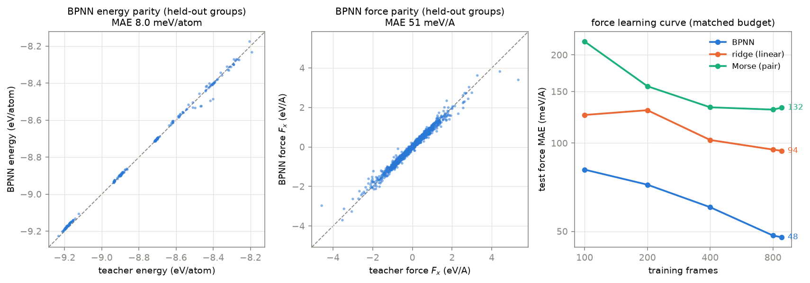

# mlip-descriptor-potential

A Behler-Parrinello neural network potential for BCC TiZrNb solid solutions,
built from scratch: my own periodic neighbor lists, atom-centered symmetry
functions, per-element networks, autograd forces, and training loop, in plain
PyTorch. The point of this repo is to do the classical descriptor-based MLIP
properly and measure exactly what the many-body machinery buys over honest
cheap baselines at matched training data and budget.

Labels come from a pretrained universal potential (CHGNet) used as a teacher,
so every accuracy number below is distillation accuracy against that surrogate,
not against DFT. Real DFT appears in exactly one role: Materials Project
anchor values for the equation-of-state sanity check.

## Results

Held-out test error, split by generation group and composition (never random
frames), all three models trained on the same 882 frames with the same loss
and epoch budget (1,566 teacher-labeled frames total, 72 generation groups;
the test set is stratified so every batch type, including the hardest rattles
and MD snapshots, is represented):

| model | parameters | energy MAE (meV/atom) | force MAE (meV/A) |
|---|---|---|---|
| BPNN (this work) | 7,971 | **8.04** | **50.6** |
| ridge on the same descriptors | 147 | 9.60 | 95.4 |
| Morse pair potential | 21 | 12.32 | 128.7 |



The headline finding is where the many-body terms actually earn their keep at
this data scale: forces. The BPNN cuts force error by 1.9x against a fairly
tuned ridge model on identical descriptors (and 2.5x against Morse), and that
lead holds at every training-set size on the learning curve. The energy edge
is much more modest, 1.2x, because the composition-linear reference and the
descriptors themselves already carry most of the energy signal. On transfer
to compositions never trained on (Ti2ZrNb, TiZrNb2, 348 frames) the ridge
model even edges the BPNN on energies (9.6 vs 11.3 meV/atom) while the BPNN
keeps a 1.6x force advantage (65 vs 102 meV/A); small linear models
extrapolate composition more gracefully than networks, and this repo says so.

The honesty checks, reported rather than buried:

- **Split gap.** The same BPNN, budget, and data under a random-frame split
  claims 3.05 +/- 0.20 meV/atom and 43 +/- 2 meV/A across three split seeds;
  the leakage-safe group split measures 8.55 +/- 1.55 and 56 +/- 7. Sibling
  frames from one rattle or MD batch leak across a random split and overstate
  energy accuracy 2.8x. Every headline number here uses the group split.
- **A correction made during the build, stated plainly:** the first group
  split drew held-out groups uniformly and happened to hold out no
  high-amplitude-rattle or MD groups, flattering the headline (3.3 meV/atom,
  32 meV/A on that easier test). The split is now stratified by batch type
  and all numbers come from the stratified rerun.
- **Force weight.** The sweep maps the tradeoff
  (`results/figures/force_weight.png`): weight 0 collapses forces
  (126 meV/A), weight 1 buys the best forces (43) at an energy cost, and 0.1
  is the best compromise (single-seed sweep; the non-monotonic 0.01 point
  shows run-to-run noise of a few meV/atom). The shipped model uses 0.1.
- **NVE drift.** At or below 0.001 meV/atom/ps over 3 ps at 300 to 900 K
  with a 2 fs timestep; total-energy fluctuations stay under 0.05 meV/atom
  (`results/figures/nve.png`). Autograd forces are exact gradients, and it
  shows.

Equation of state: Birch-Murnaghan fits of the student track the teacher to
0.002 A in a0 for BCC Nb (167 vs 167 GPa in B0) and 0.022 A for BCC Ti, both
near the Materials Project anchors; BCC Zr is the weak spot, 0.047 A high in
a0 and 22 GPa soft in B0 against the teacher, reported as such. For
mechanically unstable BCC Ti the teacher itself sits 37 GPa below the MP B0,
a teacher limitation the student inherits (`results/figures/eos.png`).

Full numbers: [RESULTS.md](RESULTS.md) and `results/metrics.json`.

## What this is, and is not

This is a teaching-quality but real implementation of the descriptor-based
MLIP stack, benchmarked with the leakage discipline that the field's better
papers use. It is not a production potential: the ceiling of every number is
the teacher (itself a surrogate for DFT), the sampled regime is modest
(rattles, strains, short MD to 1400 K, 16 to 54 atoms, BCC only), and no
claim is made about HCP phases, defects, surfaces, or melts. See the
[model card](docs/model_card.md).

## Install and run

```bash
python -m venv .venv && .venv/bin/pip install -e ".[dev]"        # core + tests
pip install -e ".[teacher]"                                       # + CHGNet, for labeling
```

The committed sample data and checkpoints make the demo instant:

```bash
descpot predict --model models/bpnn_main.pt --xyz data/sample_frames.extxyz --forces
descpot eos     --model models/bpnn_main.pt --composition Nb
descpot md      --model models/bpnn_main.pt --composition TiZrNb --steps 500
```

Full reproduction (data generation, all benchmarks, figures, about an hour on
CPU):

```bash
python scripts/run_all.py
```

The tutorial notebook (`notebooks/tutorial.ipynb`, committed executed) walks
data generation, teacher labeling, descriptors, the group split, training, and
the final held-out metric with a figure at each step.

## Layout

```
src/descpot/        library (neighbors, descriptors, models, training, eos, md, cli)
configs/            fixed-seed YAML configs for every benchmark
scripts/            generate_data, fetch_mp_anchors, run_benchmarks, figures, notebook
data/               committed sample + anchors + provenance (full dataset gitignored)
models/             committed trained checkpoints (BPNN, ridge, Morse)
results/            metrics.json, per-benchmark JSONs, figures
docs/               api.md, model_card.md
tests/              pytest suite (43 tests)
```

## Method notes

- **Descriptors.** 24 radial G2 (8 shifted Gaussians x 3 neighbor elements,
  rc 5.5 A) and 24 angular G4 (4 parameter sets x 6 element pairs, rc 4.5 A),
  cosine cutoffs, float64, differentiable end to end.
- **Neighbor lists.** From-scratch periodic pair and triplet lists for general
  triclinic (strained) cells, tested against ASE, including atoms outside the
  cell and image-wrapping invariance.
- **Models.** Per-element MLPs on standardized descriptors over a fixed
  composition-linear reference. The ridge baseline is the identical descriptor
  set with a linear readout, trained by the same loop with weight decay swept
  on validation; the Morse baseline is 6 element-pair (D, a, r0) triples.
  Forces for all three are exact autograd gradients.
- **Leakage discipline.** Splits assign whole generation groups (a rattle
  batch, a strain batch, an MD run) and hold out whole compositions. The
  random-frame alternative is computed once as a control and reported.

## Author

Aamir Malik

- GitHub: https://github.com/aamirmalik-dr
- LinkedIn: https://linkedin.com/in/aamirmalik-dr

## License

MIT for all code, committed model weights, and committed generated data. See
[LICENSE](LICENSE). CHGNet (BSD-3-Clause) and ASE (LGPL-2.1+) are pip
dependencies, not vendored. Materials Project anchor values are CC BY 4.0.
